# DungeonKUrawler - Design D1 Updated Sections

This document updates the previous D1 pages for the current codebase. It replaces the old controller/UI names in the original PDF with the classes that are now implemented, and adds the ranged-combat and armor behavior that was added later.

## Communication Diagrams

### 1. Start Game

Current flow: the main menu no longer starts a dungeon directly in every case. `START GAME` enters the tower flow. If no save exists, a new tower run is created; if saves exist, the player chooses a save first.

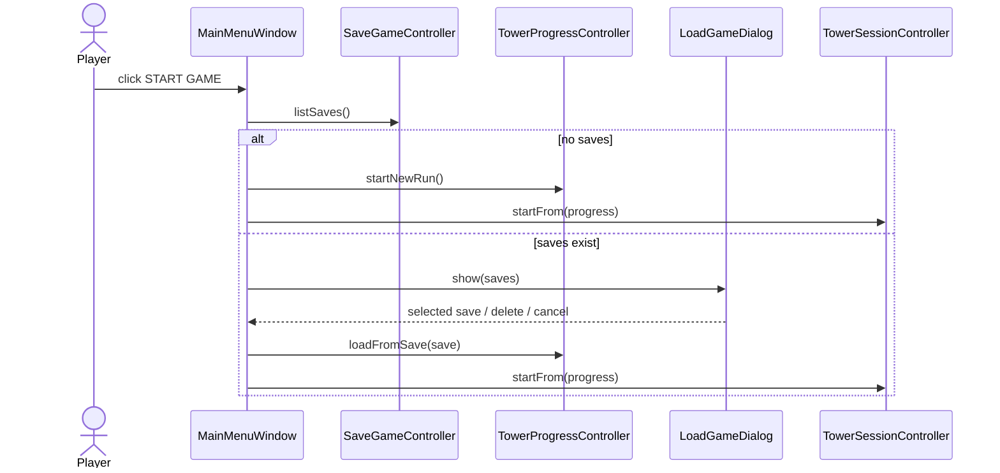

Key classes: `MainMenuWindow`, `SaveGameController`, `TowerProgressController`, `LoadGameDialog`, `TowerSessionController`.

### 2. Build Map

Current flow: `DesignWindow` is the build-mode UI. It delegates map mutation to `BuildModeController`, which delegates validation/placement to `StandardBuildPlacementStrategy`.

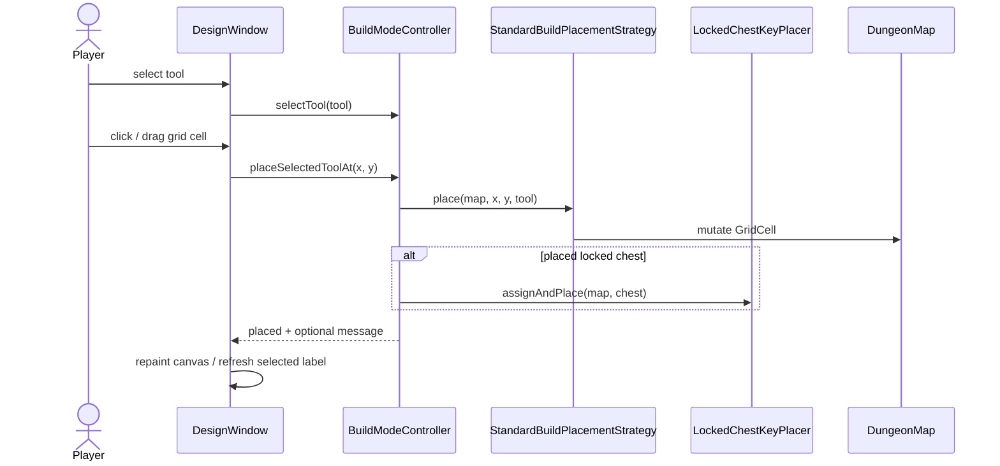

Key classes: `DesignWindow`, `BuildModeController`, `BuildToolCatalog`, `BuildTool`, `StandardBuildPlacementStrategy`, `LockedChestKeyPlacer`, `DungeonMap`, `GridCell`.

### 3. Load Map

There are two load-map paths now: load a designed map directly from the main menu, or load/save inside build mode.

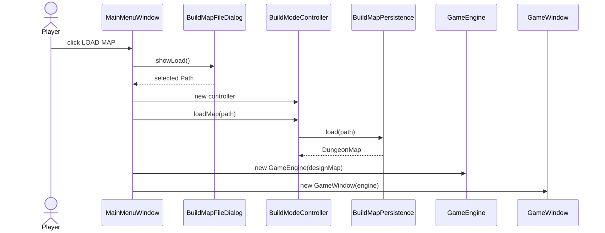

Build-mode save/load uses the same persistence service:

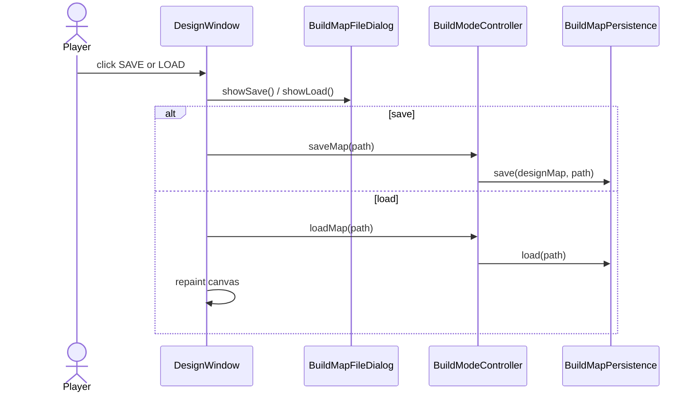

Key classes: `BuildMapFileDialog`, `BuildModeController`, `BuildMapPersistence`, `MainMenuWindow`, `DesignWindow`.

### 4. Add Random Items

Current flow: the old `RandomItemGenerator` is now `BuildRandomItemPlacer`. The controller limits this action to three uses per map with `MAX_RANDOM_ITEM_ADDS = 3`.

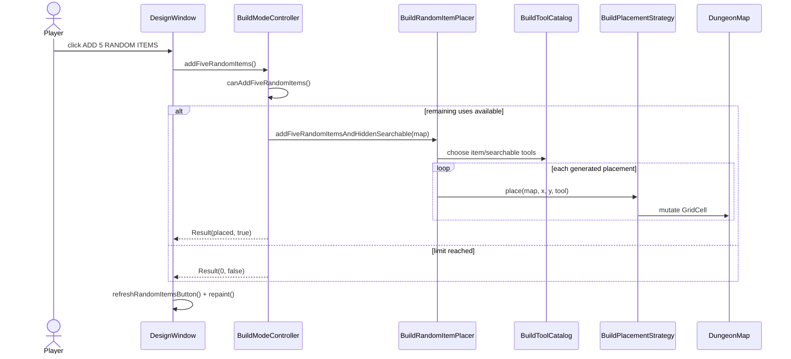

Key classes: `BuildModeController`, `BuildRandomItemPlacer`, `BuildToolCatalog`, `BuildPlacementStrategy`, `DungeonMap`.

### 5. Run Map in Play Mode

Current flow: `DesignWindow` validates/uses its design map by constructing a `GameEngine`, then opens `GameWindow`. `GameWindow` creates the player-facing controllers and `GamePanel`.

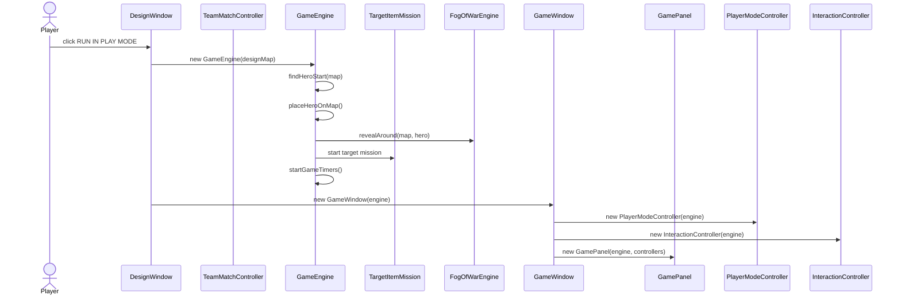

Team Match is a separate run option:

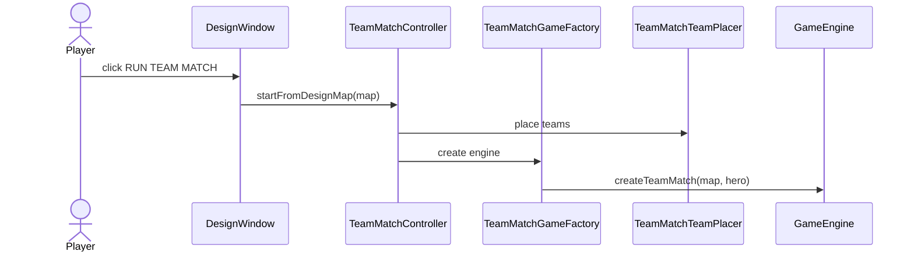

Key classes: `DesignWindow`, `GameEngine`, `GameWindow`, `GamePanel`, `PlayerModeController`, `InteractionController`, `TeamMatchController`.

### 6. Move Hero

Current flow: movement is keyboard-driven from `GamePanel`, but movement rules live in `PlayerModeController` and `GameEngine`.

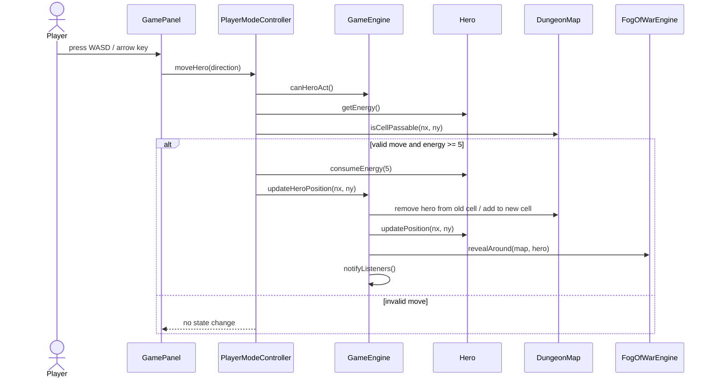

Key classes: `GamePanel`, `PlayerModeController`, `GameEngine`, `Hero`, `DungeonMap`, `FogOfWarEngine`.

### 7. Interact with Object

Current flow: mouse click selects a visible grid cell. `GamePanel` first attempts combat on the clicked cell, then asks `InteractionController` for item interactions.

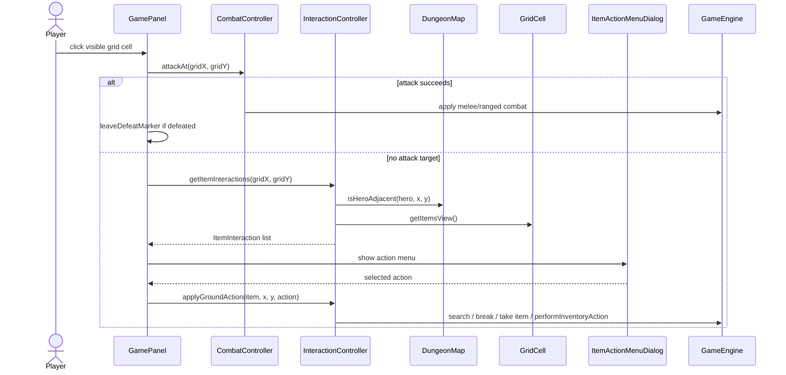

Key classes: `GamePanel`, `CombatController`, `InteractionController`, `ItemActionMenuDialog`, `GameEngine`, `DungeonMap`.

### 8. Collect Item

Current flow: item pickup is shared by keyboard (`T`), click interaction, container loot, and search results. Coins and valuables bypass the 8-slot per-level bag.

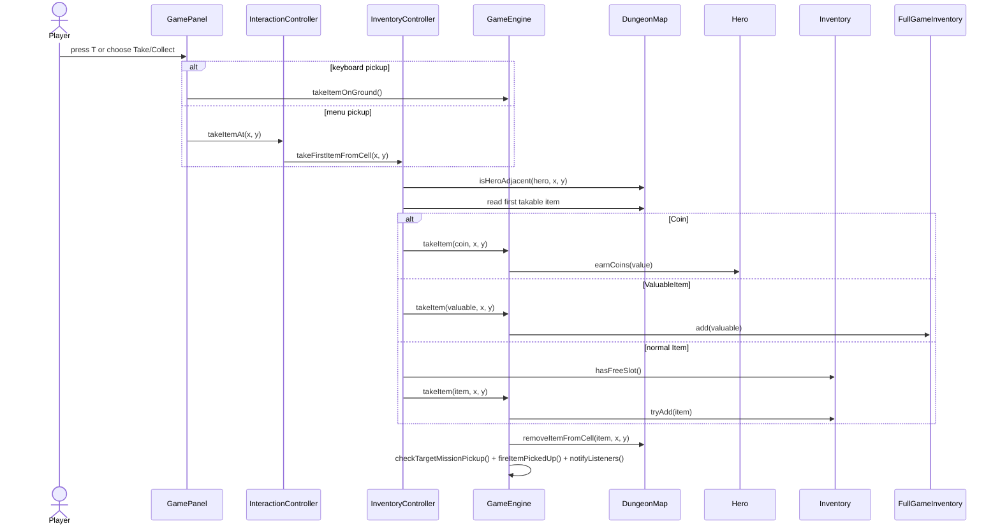

Key classes: `GamePanel`, `InteractionController`, `InventoryController`, `GameEngine`, `Hero`, `Inventory`, `FullGameInventory`.

### 9. Manage Inventory

Current flow: inventory UI lists carried items and their actions. The effect of each action is delegated through `ItemActionEffects`, which is a command/strategy registry.

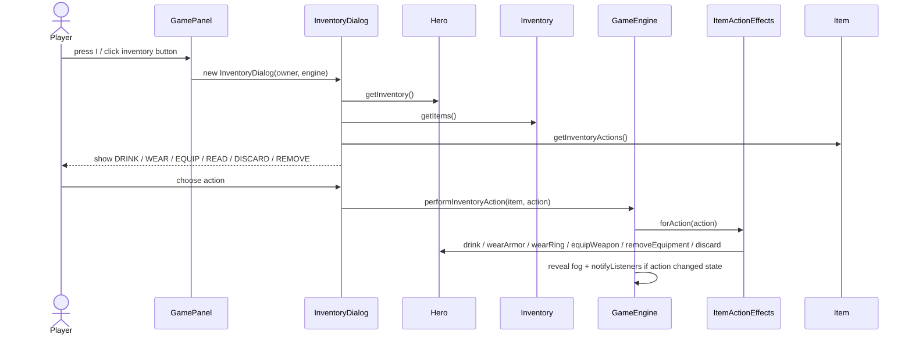

Armor-specific path:

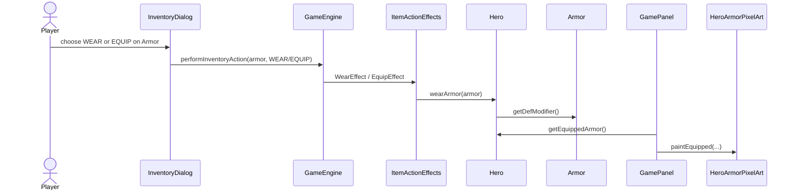

Key classes: `InventoryDialog`, `GameEngine`, `ItemActionEffects`, `Hero`, `Armor`, `Weapon`, `Ring`, `Inventory`.

### 10. Fight Enemy

Current flow: combat supports melee, enemy projectiles, and hero-owned ranged projectiles.

#### 10A. Melee Attack

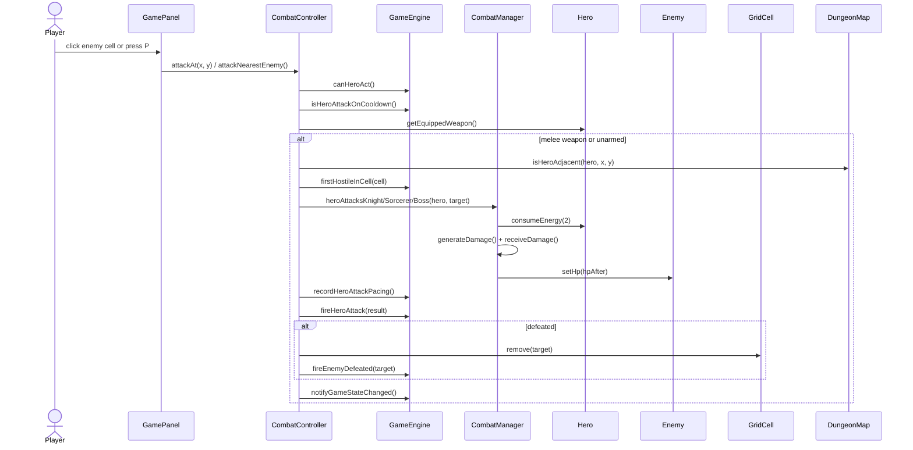

#### 10B. Ranged Attack

Current ranged weapons:

| Weapon | Category | ATK | Range setting | Cost | Projectile |
| --- | --- | ---: | --- | --- | --- |
| Wooden Bow | bows | 6 | `WeaponType.maxRange = 4`; current test build ignores range in `canHeroRangedTarget` and keeps line-of-sight only | 3 Energy | Arrow |
| Magic Wand | staves | 8 | `WeaponType.maxRange = 4`; current test build ignores range in `canHeroRangedTarget` and keeps line-of-sight only | 5 Mana | Ice bolt |

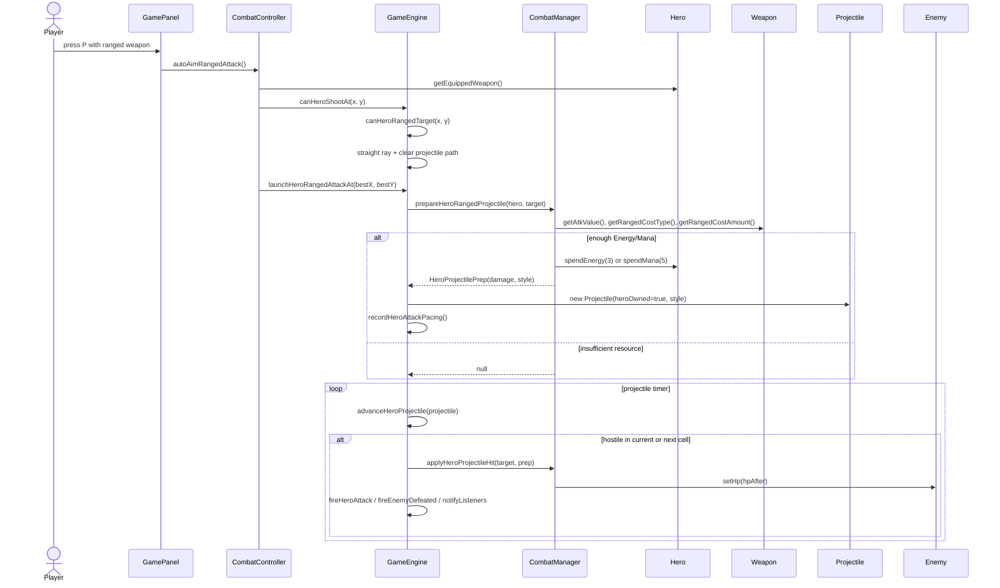

Enemy projectile path:

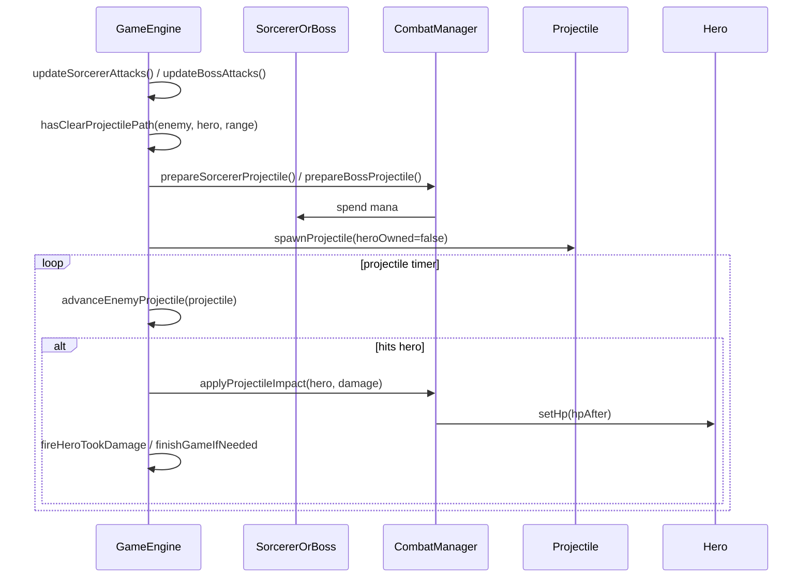

Key classes: `CombatController`, `CombatManager`, `GameEngine`, `Projectile`, `Weapon`, `WeaponType`, `HeroProjectileStyle`, `RangedCostType`, `Hero`, `Knight`, `Sorcerer`, `BossEnemy`.

## UML Class Diagram - Updated Class List and Relationships

The original PDF class diagram used older placeholders such as `GameController`, `MapEditorController`, `BuildMapUI`, `PlayModeUI`, `Map`, and generic `Enemy`. The current implementation has more specific classes and separates UI, controllers, services, model objects, rendering, and persistence.

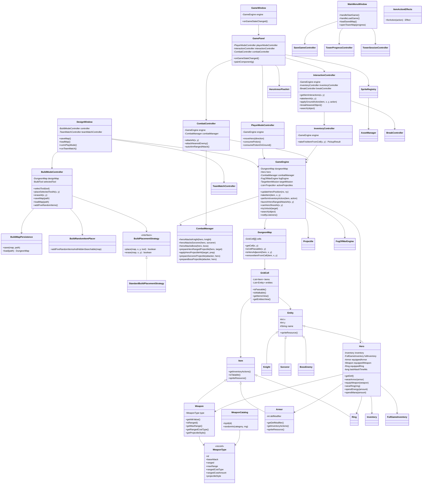

## Design Alternatives Discussion

### Current Design

The current design is controller/service oriented and closer to GRASP than the earlier D1 draft. UI classes forward user intent; controllers coordinate use cases; model classes own state; service/factory/catalog classes isolate creation, persistence, combat math, rendering assets, and rules.

Current responsibilities:

- `MainMenuWindow`: top-level navigation; starts tower flow, load-game flow, load-map flow, or build mode.
- `DesignWindow`: build-mode view; delegates all map edits to `BuildModeController`.
- `BuildModeController`: build-mode GRASP Controller; owns selected tool, design map, save/load, random item count, and placement requests.
- `StandardBuildPlacementStrategy`: placement rules for floors, walls, tools, items, containers, weapons, armor, and searchables.
- `BuildMapPersistence`: serializes/deserializes designed maps.
- `GameWindow` and `GamePanel`: gameplay shell and observer/rendering surface. They forward key/mouse input to controllers and repaint after `GameEngine` notifications.
- `GameEngine`: central game-state owner and observer subject. It owns map, hero, timers, mission state, fog, projectiles, enemy spawning/AI ticks, pickup/search/open logic, and listener notifications.
- `PlayerModeController`: movement use case; checks energy and passability before asking `GameEngine` to move the hero.
- `InteractionController`: ground item interaction, search, break, and take/use-on-ground flow.
- `InventoryController`: pickup validation and item transfer from map to inventory/full inventory.
- `CombatController`: player-initiated melee/ranged combat and auto-aim.
- `CombatManager`: stateless combat formulas, resource spending for ranged attacks, projectile prep, and damage application.
- `ItemActionEffects`: command/strategy registry for inventory actions (`DRINK`, `WEAR`, `EQUIP`, `READ`, `REMOVE`, `DISCARD`, `SEARCH`, `BREAK`, `OPEN`, etc.).
- `WeaponCatalog` / `WeaponType`: Flyweight catalog for weapon stats and sprites. B23 ranged weapons are registered here.
- `Armor`: equipment item that contributes to `Hero.getDef()` and supplies `/weapons/armor.png` as its item sprite.
- `HeroArmorPixelArt`: fitted equipped-armor overlay for the hero sprite; item icon and equipped overlay are intentionally separate.

### Pros

- Clearer separation between UI and rules than the old D1 diagram.
- Build mode uses a Strategy (`BuildPlacementStrategy`) instead of placing everything directly in the UI.
- Inventory action behavior is extensible through `ItemActionEffects` instead of a large UI switch.
- Combat math is centralized in `CombatManager`.
- Ranged weapons are data-driven through `WeaponType` and `WeaponCatalog`.
- Rendering assets are separated through `SpriteRegistry`, `AssetManager`, and sprite-resource overrides.
- Armor is integrated as normal equipment: inventory action, DEF calculation, item sprite, and equipped visual.
- `GameEngine` implements observer-style listener notification so views repaint after state changes.

### Cons / Remaining Risks

- `GameEngine` is still large. It owns core state, timers, projectiles, enemy AI updates, mission state, pickups, search, locks, fog, and notifications.
- `GamePanel` still has many rendering and input responsibilities in one class.
- Hero ranged range is currently in test mode: `WeaponType.maxRange` is 4, but `GameEngine.canHeroRangedTarget` and `CombatController.autoAimRangedAttack` currently use `Integer.MAX_VALUE` while preserving straight-line and wall/projectile-block checks.
- Some class names changed significantly from the earlier D1 diagrams, so old documentation using `GameController`, `MapEditorController`, `BuildMapUI`, `PlayModeUI`, and generic `Enemy` no longer matches the code.

### Alternative 1: Split GameEngine into Smaller Services

Move projectile ticking, enemy AI timers, mission/floor completion, and pickup/search/open logic into separate services/controllers.

Pros:

- `GameEngine` would become a thinner state facade.
- Easier unit testing for projectile movement and enemy AI.
- Lower risk when modifying one subsystem.

Cons:

- More dependency wiring.
- More classes for teammates to understand.
- Current project size may not justify full decomposition yet.

Recommended use: split next if new combat/AI/floor mechanics continue to grow.

### Alternative 2: Keep GameEngine as Facade, Extract Rendering Helpers

Keep `GameEngine` as the state owner, but move more `GamePanel` drawing into small renderers, similar to `AmbienceRenderer`.

Pros:

- Reduces `GamePanel` size.
- Makes ranged projectile, HUD, hero equipment, and item drawing easier to maintain.
- Preserves current controller/model architecture.

Cons:

- Rendering helpers need stable inputs and careful ordering.
- Does not reduce `GameEngine` complexity.

Recommended use: good near-term refactor because the current UI has grown with ranged weapons, armor, fog, pets, HUD, projectiles, and animation.

### Alternative 3: Make Ranged Weapon Rules Fully Data-Driven

Restore strict `weapon.getMaxRange()` checks and move all B23 weapon values into a data file or dedicated catalog configuration.

Pros:

- Easier balancing: bow/wand cost, damage, range, projectile style can be changed without touching combat flow.
- Documentation and code will match weapon stats exactly.
- Avoids temporary test-mode range behavior becoming accidental final behavior.

Cons:

- Needs migration or validation for old saved maps.
- More data validation required.

Recommended use: before final submission, restore dynamic max-range behavior if the requirement says weapons must be range-limited.

### Alternative 4: Treat Armor Visuals as Two Separate Assets

Current implementation uses `/weapons/armor.png` for item/build/inventory display and code-drawn fitted overlay for the equipped hero.

Pros:

- Item icon can remain high quality.
- Equipped armor does not replace or distort the hero sprite.
- Weapons still draw on top of armor because `GamePanel` draws armor first, then equipped weapon.

Cons:

- Item icon and equipped overlay are not identical.
- More manual pixel tuning may be needed if hero sprite changes.

Recommended use: keep this split. A full armor PNG is good as an item icon, but too large to draw directly on the 16x32 hero sprite.

## Pattern / GRASP Notes

- Controller: `BuildModeController`, `PlayerModeController`, `InteractionController`, `InventoryController`, `CombatController`, `TeamMatchController`.
- Information Expert: `Hero` owns equipment and derived DEF; `Inventory` owns capacity; `DungeonMap` owns cells; `GridCell` owns local items/entities.
- Low Coupling: UI delegates to controllers; action effects are isolated in `ItemActionEffects`; rendering assets are isolated from model through sprite-resource paths and registries.
- High Cohesion: `CombatManager` handles combat formulas; `BuildMapPersistence` handles map persistence; `BuildRandomItemPlacer` handles random build-mode placement.
- Strategy: `BuildPlacementStrategy`, `EnemySpawnPolicy`, `VisibilityStrategy`, `ItemActionEffects.Effect`.
- Observer: `GameEngine` notifies `GameStateListener`; audio/game events are emitted through `GameEventListener` and mission listeners.
- Flyweight: `WeaponType` stores shared weapon intrinsic state; `Weapon` instances reference it.
- Singleton/Flyweight cache: `AssetManager` caches loaded sprites.

## Implementation Facts Added Since Original D1

- Ranged weapons:
  - `Wooden Bow`: ATK 6, Energy cost 3, projectile style `ARROW`.
  - `Magic Wand`: ATK 8, Mana cost 5, projectile style `ICE_BOLT`.
  - Both are registered in `WeaponCatalog.registerB23RangedWeapons()`.
- Ranged pacing:
  - Hero attacks use `Hero.lastAttackTimeMs`.
  - `GameConstants.GLOBAL_ACTION_TICK_MS` controls the cooldown.
  - `CombatController` ignores inputs during cooldown.
- Projectiles:
  - Hero-owned projectiles and enemy-owned projectiles share `Projectile`.
  - `GameEngine.updateProjectiles()` advances them on a timer.
  - Hero projectiles check the current cell before moving, then the next cell, so moving enemies are less likely to be skipped.
- Armor:
  - `Armor.getInventoryActions()` returns `WEAR`, `EQUIP`, and `DISCARD`.
  - `ItemActionEffects.WearEffect` and `EquipEffect` both support armor.
  - `Hero.getDef()` adds base DEF + armor bonus + ring bonus.
  - `Armor.spriteResource()` returns `/weapons/armor.png`.
  - Equipped armor is drawn with `HeroArmorPixelArt.paintEquipped(...)` so it fits the hero sprite and does not cover the weapon overlay.
- Rendering:
  - No external runtime image downloads are used.
  - Existing local sprites live under `src/main/resources`.
  - Bow/wand custom pixel art is drawn in `GamePanel`, `DesignWindow`, and `InventoryDialog`.
  - Armor item icon uses the local PNG, while equipped armor uses fitted pixel overlay.

