# Key Architecture Diagrams

## Scope

Keys are a core progression item in DungeonKUrawler. They can be found on the map, inside chests, and later inside searchable locations. They can unlock gates and keyed containers such as chests. A key may be reusable, consumed after use, or scoped to a specific lock id depending on the game design.

Available key assets currently exist under:

- `src/main/resources/items_keys_extracted/assets/01_key_olive.png`
- `src/main/resources/items_keys_extracted/assets/02_key_silver.png`
- `src/main/resources/items_keys_extracted/assets/03_key_gold.png`
- `src/main/resources/items_keys_extracted/assets/04_key_orange.png`
- `src/main/resources/items_keys_extracted/assets/05_key_bent_silver.png`
- `src/main/resources/items_keys_extracted/assets/06_key_long_gold.png`

## Use Case Diagram

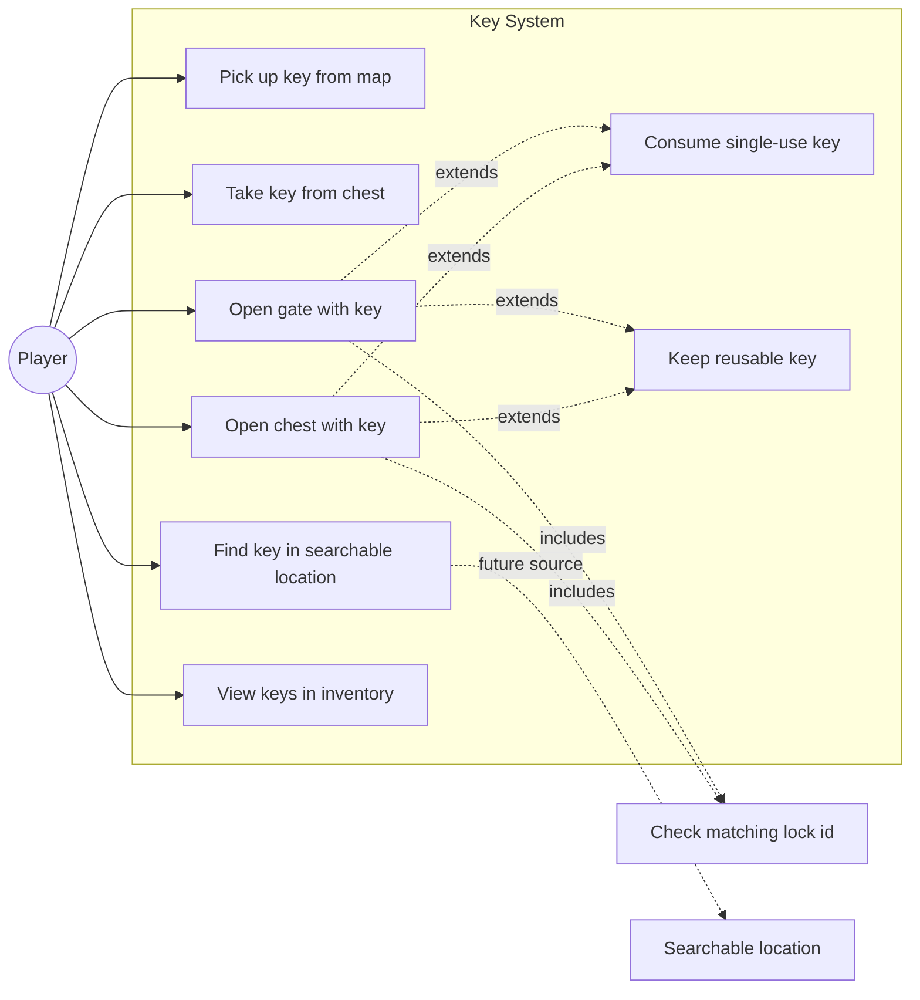

## SSD: Pick Up Key From Map

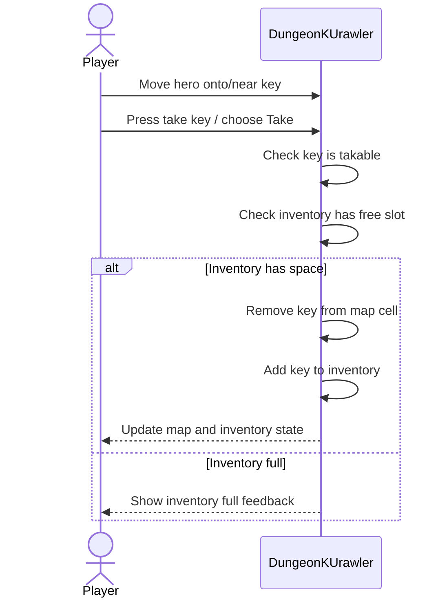

## SSD: Take Key From Chest

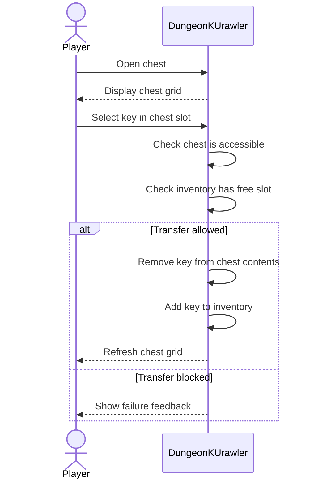

## SSD: Find Key In Searchable Location

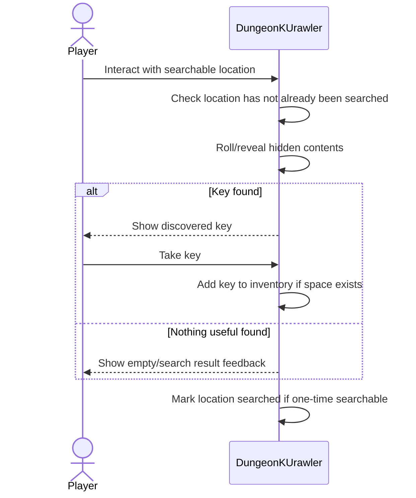

## SSD: Open Gate With Key

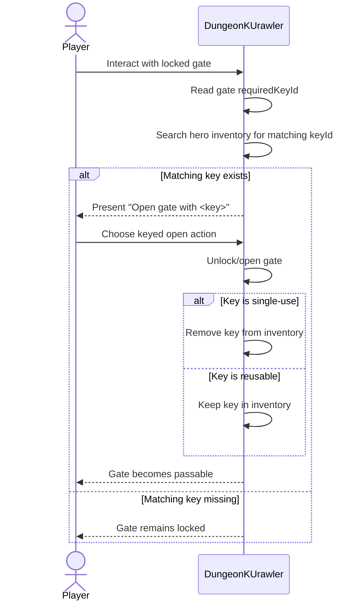

## SSD: Open Chest With Key

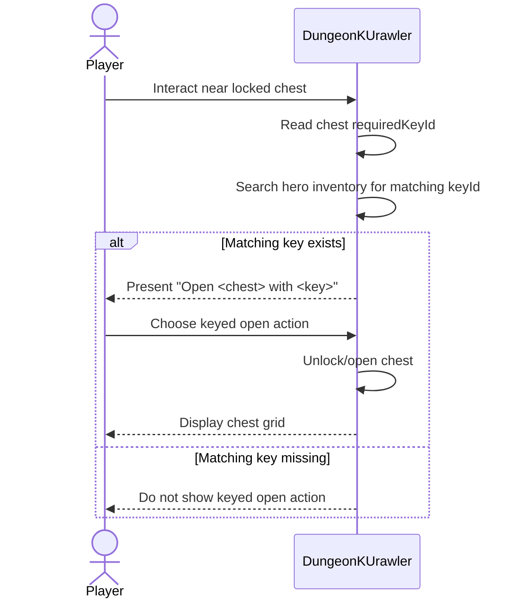

## Logical Architecture

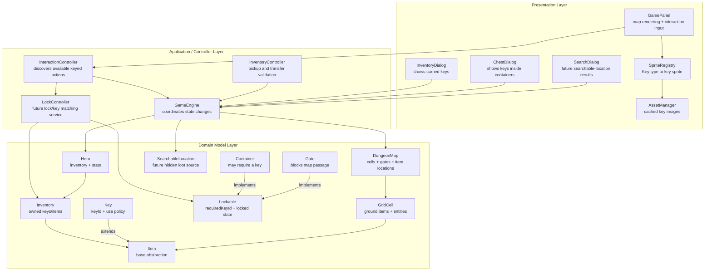

## GRASP Responsibility Assignment

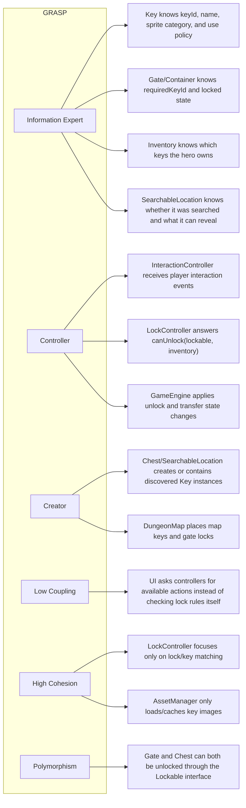

## GoF Pattern View

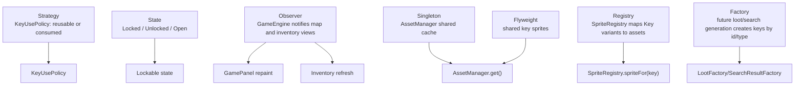

## Proposed Key Domain Model

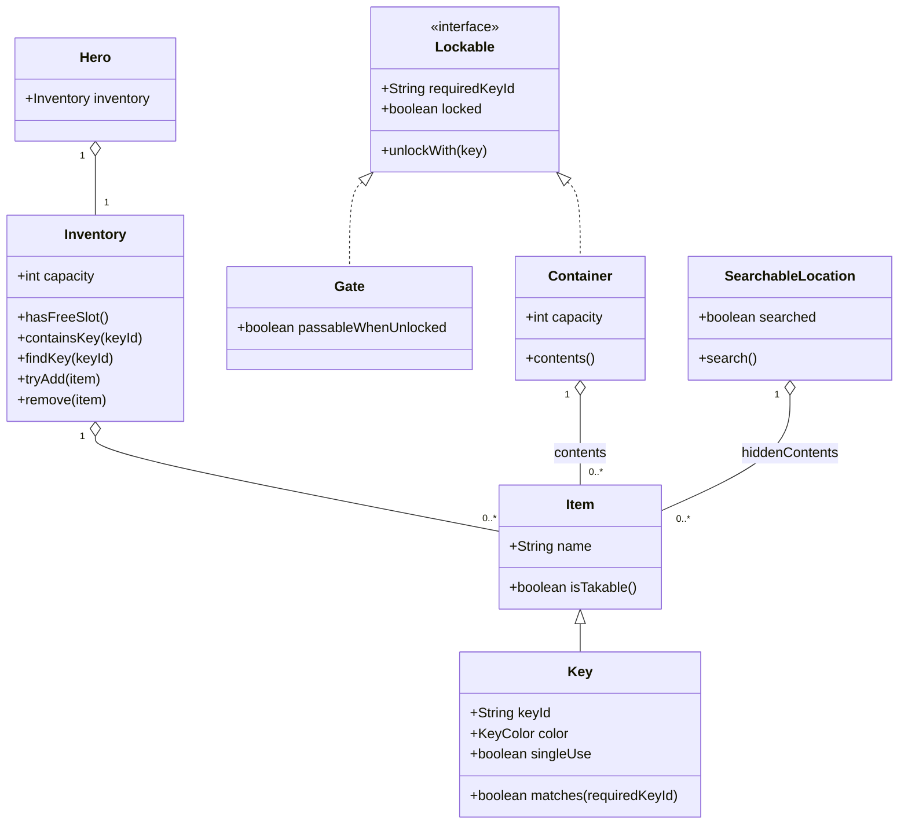

## Key Source and Sink Flow

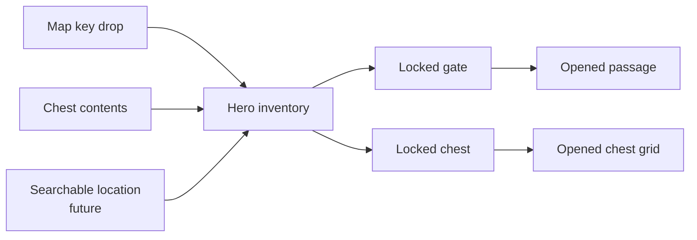

## Suggested Key Types

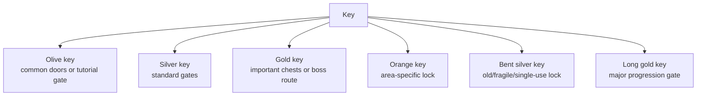

## Design Notes

- A `keyId` should be the real lock matcher; color/name should be presentation and game-feel metadata.
- Gates and chests should share a `Lockable` abstraction so the keyed action flow is not duplicated.
- The action list should only show `Open <target> with <key>` when the matching key exists in inventory.
- Searchable locations should be modeled as loot sources, like chests, but with search state and possible random/revealed results.
- Single-use keys add tension; reusable keys support region-wide progression. This should be a key property, not hardcoded in gate or chest logic.
