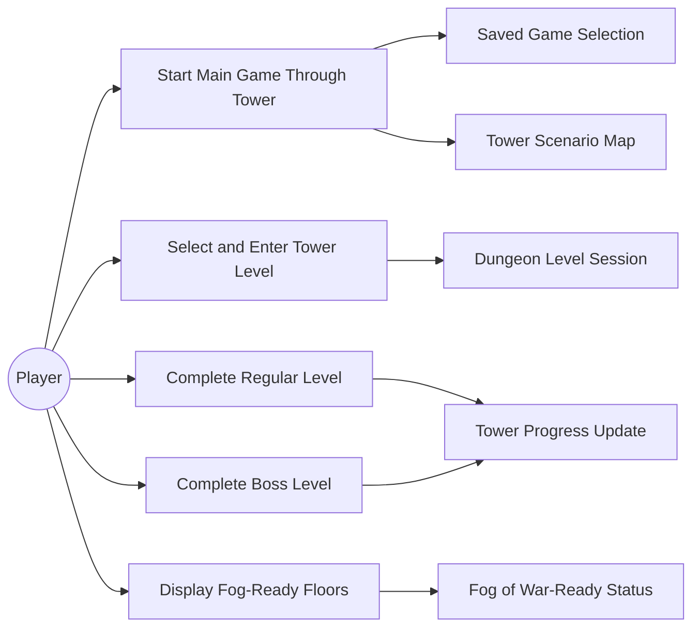
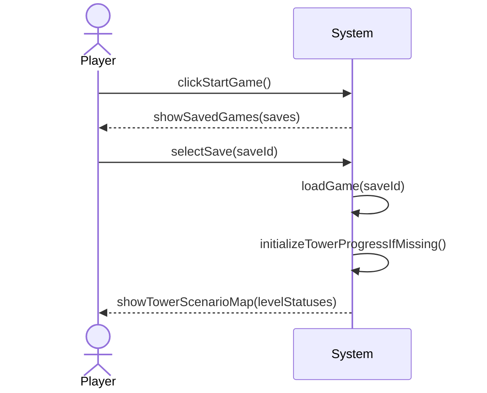
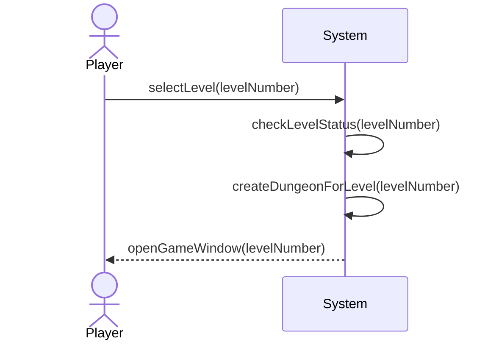
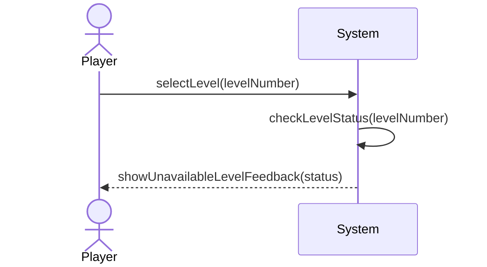
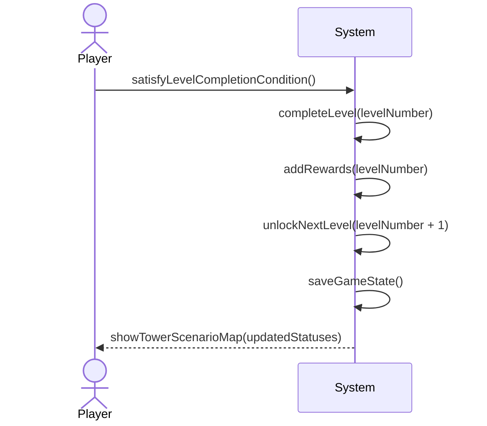
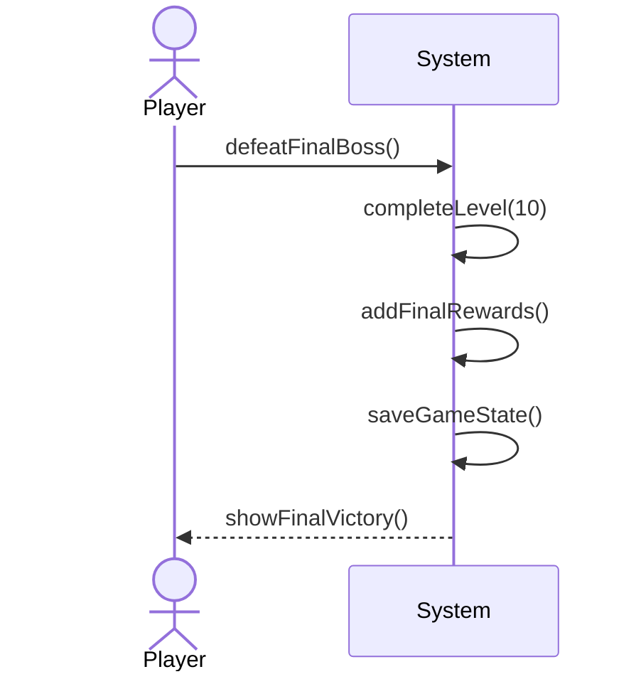
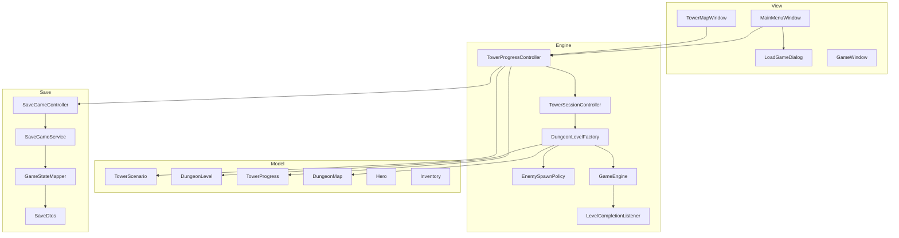
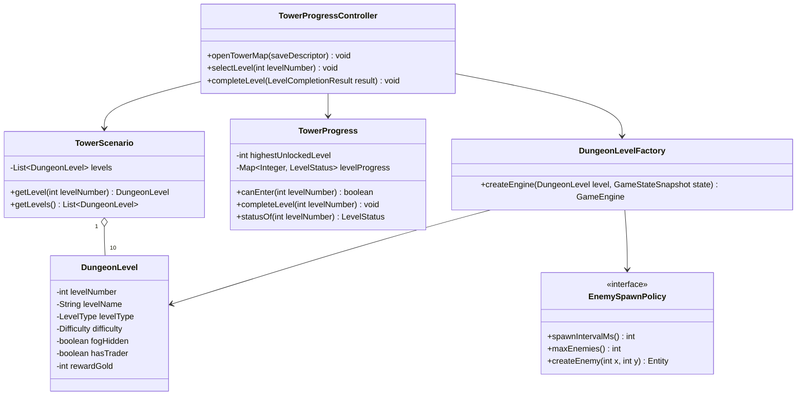

# 10-Level Tower Scenario Map Design

## Scope

The tower progression is the main game mode. The current `Start Game` flow in `MainMenuWindow` should no longer create a fresh `GameEngine` directly. It should ask the player to select a saved game, load that save, open the Tower Scenario Map, and only start a dungeon after the player chooses an unlocked floor.

The design keeps Swing views thin, keeps progression rules in controller/domain services, and extends the existing save/load boundary instead of duplicating persistence logic.

## Domain Vocabulary

### Enums

```java
public enum LevelType {
    REGULAR,
    BOSS,
    FINAL_BOSS
}
```

```java
public enum Difficulty {
    EASY,
    MEDIUM,
    HARD,
    VERY_HARD,
    BOSS
}
```

```java
public enum LevelStatus {
    LOCKED,
    UNLOCKED,
    COMPLETED,
    HIDDEN
}
```

### Core Model Classes

```java
public final class DungeonLevel {
    private final int levelNumber;
    private final String levelName;
    private final LevelType levelType;
    private final Difficulty difficulty;
    private final boolean fogHidden;
    private final boolean hasTrader;
    private final int rewardGold;
}
```

`DungeonLevel` should describe static level configuration. It should not store mutable completion state. This follows GRASP Information Expert because the level knows its own fixed metadata, while progress is owned by the saved game/tower progress object.

```java
public final class TowerProgress {
    private int highestUnlockedLevel;
    private Map<Integer, LevelStatus> levelProgress;

    public boolean canEnter(int levelNumber);
    public void completeLevel(int levelNumber);
    public LevelStatus statusOf(int levelNumber);
}
```

`TowerProgress` owns unlocked/completed/hidden states. This avoids scattering progression rules across views.

```java
public final class TowerScenario {
    private final List<DungeonLevel> levels;

    public DungeonLevel getLevel(int levelNumber);
    public List<DungeonLevel> getLevels();
}
```

`TowerScenario` is the static 10-floor map definition.

### Save DTO Extension

Extend `SaveDtos.GameStateDto` with tower progress data:

```java
public TowerProgressDto towerProgress;
```

Suggested DTO:

```java
public static final class TowerProgressDto {
    public int highestUnlockedLevel;
    public List<LevelProgressDto> levels = new ArrayList<>();
}

public static final class LevelProgressDto {
    public int levelNumber;
    public String status;
}
```

Keep DTOs simple strings/ints for Gson compatibility and map them through `GameStateMapper`.

## Level Configuration

| Level | Type | Difficulty | Initial Status | Trader | Fog Hidden | Reward |
| --- | --- | --- | --- | --- | --- | --- |
| 1 | REGULAR | EASY | UNLOCKED | true | false | 50 |
| 2 | REGULAR | EASY | LOCKED | false | false | 75 |
| 3 | REGULAR | MEDIUM | LOCKED | true | false | 100 |
| 4 | REGULAR | MEDIUM | LOCKED | false | false | 125 |
| 5 | BOSS | BOSS | LOCKED | false | false | 250 |
| 6 | REGULAR | HARD | LOCKED | true | false | 175 |
| 7 | REGULAR | HARD | HIDDEN later | false | true | 200 |
| 8 | REGULAR | VERY_HARD | HIDDEN later | true | true | 225 |
| 9 | REGULAR | VERY_HARD | HIDDEN later | false | true | 250 |
| 10 | FINAL_BOSS | BOSS | HIDDEN later | false | true | 500 |

For the first implementation, levels 7 through 10 may still be stored as `LOCKED`, but `DungeonLevel.fogHidden == true` and `LevelStatus.HIDDEN` must be supported so the UI can later render them as unknown.

## Use Cases

### UC-T1: Start Main Game Through Tower

Primary actor: Player

Preconditions:
- At least one saved game exists.
- The application is on the main menu.

Main success scenario:
1. Player clicks `Start Game`.
2. System displays saved games.
3. Player selects a saved game.
4. System loads the selected saved game.
5. System initializes missing tower progress if the save was created before tower mode.
6. System opens the Tower Scenario Map.
7. System displays 10 floors with correct locked, unlocked, completed, and hidden states.

Alternatives:
- 2a. No saved games exist: system shows a "No Saves" message and stays on the main menu.
- 3a. Player cancels: system returns to the main menu.
- 4a. Save cannot be loaded: system shows an error and allows choosing another save.

Postconditions:
- Selected game state is loaded.
- Tower Scenario Map is visible.
- No dungeon level starts until the player selects an unlocked floor.

### UC-T2: Select and Enter Tower Level

Primary actor: Player

Preconditions:
- A saved game is loaded.
- Tower Scenario Map is visible.

Main success scenario:
1. Player selects a visible tower floor.
2. System checks the floor status.
3. System confirms the level is unlocked.
4. System creates level-specific dungeon content using the level configuration.
5. System starts a `GameEngine` session for that level.
6. System opens `GameWindow`.

Alternatives:
- 3a. Level is locked: system keeps the player on the map and gives locked feedback.
- 3b. Level is hidden: system keeps the player on the map and gives unknown/hidden feedback.
- 4a. Level generation fails: system shows an error and returns to the map.

Postconditions:
- Active game session corresponds to the selected tower level.
- Tower progress is unchanged until the level is completed.

### UC-T3: Complete Regular Level

Primary actor: Player

Preconditions:
- Player is inside an unlocked regular dungeon level.
- Level completion condition is satisfied.

Main success scenario:
1. System detects level completion.
2. System marks the current level as `COMPLETED`.
3. System unlocks the next level if one exists.
4. System adds reward gold and collected items to the saved game state.
5. System persists the updated save.
6. System returns player to the Tower Scenario Map.
7. System displays updated level statuses.

Alternatives:
- 5a. Save fails: system warns the player and keeps the completed session state available for retry.
- 3a. Current level is Level 10: system does not unlock another level and may show final victory.

Postconditions:
- Level progress is saved.
- Rewards and inventory changes are saved.
- Next level is unlocked unless the completed level was Level 10.

### UC-T4: Complete Boss Level

Primary actor: Player

Preconditions:
- Player is inside Level 5 or Level 10.
- Boss completion condition is satisfied.

Main success scenario:
1. System detects boss defeat or boss completion condition.
2. System applies boss-specific rewards.
3. System marks boss level as `COMPLETED`.
4. If Level 5, system unlocks Level 6.
5. If Level 10, system marks tower scenario as fully completed.
6. System persists the updated save.
7. System returns player to the Tower Scenario Map or final victory screen.

Alternatives:
- 1a. Player exits before completion: level remains unlocked but not completed.
- 6a. Save fails: system displays a retry/error message.

Postconditions:
- Boss completion is reflected in saved tower progress.
- Rewards are added exactly once.

### UC-T5: Display Fog-Ready Floors

Primary actor: Player

Preconditions:
- Tower Scenario Map is visible.
- Save contains or can derive tower progress.

Main success scenario:
1. System requests all tower levels and statuses.
2. System identifies levels 7 through 10 as fog-capable.
3. System renders normal statuses for levels 1 through 6.
4. System renders levels 7 through 10 as locked now, or hidden later when `LevelStatus.HIDDEN` is active.

Postconditions:
- The map can support future Fog of War without changing the domain model.

## Mermaid Diagrams

### Use Case Overview



## System Sequence Diagrams

### SSD 1: Start Game and Open Tower Map



### SSD 2: Enter an Unlocked Level



Locked/hidden alternative:



### SSD 3: Complete Level and Return to Tower



### SSD 4: Complete Final Boss



## Logical Architecture

### Package-Level View

```text
view
  MainMenuWindow
  LoadGameDialog
  TowerMapWindow
  TowerLevelButton / TowerFloorPanel
  GameWindow

engine
  TowerProgressController
  TowerSessionController
  LevelCompletionListener
  GameEngine
  DungeonLevelFactory
  EnemySpawnPolicy

model
  DungeonLevel
  TowerScenario
  TowerProgress
  LevelType
  Difficulty
  LevelStatus
  Hero
  Inventory
  DungeonMap

save
  SaveGameController
  SaveGameService
  GameStateMapper
  SaveDtos
```

### Logical Architecture Diagram



### Core Class Relationships



### Responsibility Assignment

| Class | Responsibility | Principle |
| --- | --- | --- |
| `MainMenuWindow` | Starts the main game flow by asking for a save, then delegates to tower controller. | GRASP Controller, Low Coupling |
| `TowerMapWindow` | Displays tower floors and forwards level-selection events. | MVC/View separation, Low Coupling |
| `TowerProgressController` | Handles tower use cases: load progress, enter level, complete level, unlock next level. | GRASP Controller |
| `TowerSessionController` | Coordinates transition between map and active `GameWindow`. | GRASP Controller |
| `TowerScenario` | Owns the static list of 10 configured levels. | Information Expert |
| `DungeonLevel` | Owns level metadata: type, difficulty, reward, trader, fog readiness. | Information Expert |
| `TowerProgress` | Owns mutable level status and unlock rules. | Information Expert, High Cohesion |
| `DungeonLevelFactory` | Creates configured `GameEngine`/`DungeonMap` sessions for selected levels. | GoF Factory Method/Simple Factory |
| `EnemySpawnPolicy` | Encapsulates enemy mix, spawn rate, and boss rules per difficulty. | GoF Strategy |
| `SaveGameController` | Existing facade for save/load use cases. | GRASP Controller |
| `GameStateMapper` | Maps tower progress to/from save DTOs. | Pure Fabrication, Low Coupling |

### Main Dependencies

```text
MainMenuWindow
  -> SaveGameController
  -> TowerProgressController
  -> TowerMapWindow

TowerMapWindow
  -> TowerProgressController

TowerProgressController
  -> TowerScenario
  -> TowerProgress
  -> TowerSessionController
  -> SaveGameController

TowerSessionController
  -> DungeonLevelFactory
  -> GameWindow

DungeonLevelFactory
  -> DungeonLevel
  -> DungeonMap
  -> GameEngine
  -> EnemySpawnPolicy

SaveGameController
  -> SaveGameService
  -> GameStateMapper
```

Views depend on controllers. Controllers depend on model/services. Model does not depend on Swing or persistence.

## GoF Patterns

### Strategy: Difficulty and Spawn Behavior

Use `EnemySpawnPolicy` to avoid `if level == 5` logic spreading through `GameEngine`.

```java
public interface EnemySpawnPolicy {
    int spawnIntervalMs();
    int maxEnemies();
    Entity createEnemy(int x, int y);
}
```

Possible implementations:
- `RegularEnemySpawnPolicy`
- `HardEnemySpawnPolicy`
- `BossEnemySpawnPolicy`
- `FinalBossEnemySpawnPolicy`

`DungeonLevelFactory` selects the strategy from `DungeonLevel.difficulty()` and `DungeonLevel.levelType()`.

### Factory: Level Session Creation

Use a factory to create the level session:

```java
public final class DungeonLevelFactory {
    public GameEngine createEngine(DungeonLevel level, GameStateSnapshot state) {
        DungeonMap map = createMap(level);
        EnemySpawnPolicy spawnPolicy = spawnPolicyFor(level);
        return new GameEngine(map, state.hero(), state.missionTarget(), false, false, spawnPolicy);
    }
}
```

The existing `EnemyFactory` already uses a simple factory style for enemies. The tower design can extend that idea by moving level-specific enemy probabilities into strategies.

### Observer: Level Completion

`GameEngine` already uses listeners. Add a completion event instead of making `GameWindow` poll for victory:

```java
public interface LevelCompletionListener {
    void onLevelCompleted(LevelCompletionResult result);
}
```

`TowerProgressController` listens to completion, updates progress, saves, and opens the map.

### Facade: Save System

`SaveGameService` already acts as a persistence facade. Keep tower persistence behind it by extending `GameStateMapper` and `SaveDtos`, not by writing files from tower UI/controllers.

## GRASP Alignment

- Controller: `TowerProgressController` handles system events such as `selectLevel(levelNumber)` and `completeLevel(result)`.
- Information Expert: `TowerProgress` decides whether a level can be entered and which level unlocks next.
- Creator: `TowerScenarioFactory` or `TowerScenario.defaultScenario()` creates the 10 static `DungeonLevel` objects because it has the configuration data.
- Low Coupling: `TowerMapWindow` only knows display models/statuses, not save files or dungeon generation.
- High Cohesion: save mapping remains in `GameStateMapper`; progression remains in `TowerProgress`; UI rendering remains in `TowerMapWindow`.
- Pure Fabrication: `DungeonLevelFactory` and `GameStateMapper` keep construction/mapping details out of domain classes.
- Indirection: controllers mediate between Swing windows, save services, and the engine.
- Protected Variations: `LevelStatus.HIDDEN`, `fogHidden`, and `EnemySpawnPolicy` allow Fog of War and difficulty changes without rewriting the tower map.

## Suggested Flow Changes

### Current Flow

```text
Start Game -> new GameEngine() -> GameWindow
Load Game  -> choose save -> GameEngine -> GameWindow
```

### New Main Game Flow

```text
Start Game -> choose save -> load saved GameState -> TowerMapWindow
TowerMapWindow -> select unlocked level -> GameEngine -> GameWindow
Level complete -> update save -> TowerMapWindow
```

`Load Game` can either remain a shortcut for old direct loading during development or be changed to the same tower flow for consistency. Since the feature is the main game mode, final behavior should route both `Start Game` and `Load Game` through the tower map.

## Implementation Steps

1. Add tower domain classes/enums under `model`.
2. Add `TowerScenario` static configuration for the 10 levels.
3. Extend `SaveDtos.GameStateDto` and `GameStateMapper` with `TowerProgressDto`.
4. Add backward-compatible default progress: Level 1 unlocked, all others locked/hidden-capable.
5. Add `TowerProgressController` in `engine`.
6. Add `TowerMapWindow` in `view`.
7. Change `MainMenuWindow` Start Game to show save selection and open `TowerMapWindow`.
8. Add `DungeonLevelFactory` and level-specific spawn/difficulty policies.
9. Add level completion event/listener to `GameEngine`.
10. On completion, update `TowerProgress`, apply rewards, save game, return to tower map.

## Acceptance Criteria

- `Start Game` asks the player to select a saved game before gameplay starts.
- Loading a save opens the Tower Scenario Map, not direct gameplay.
- Level 1 is unlocked for new/default tower progress.
- Locked levels cannot be entered.
- Completing Level N marks it completed and unlocks Level N + 1.
- Completing Level 5 unlocks Level 6 and applies boss rewards.
- Completing Level 10 ends the tower progression.
- Levels 7 through 10 have fog-ready metadata/status support.
- Gold, inventory, purchased items, completed levels, and unlocked levels persist in the selected save.
- Swing views do not contain progression rules.
